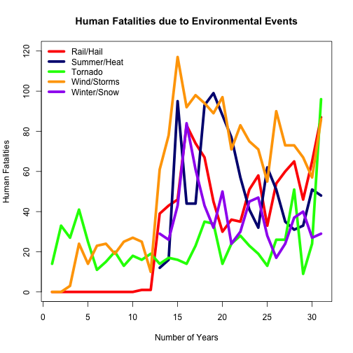
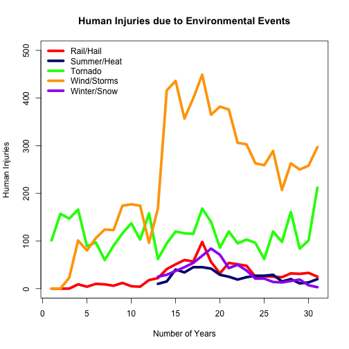
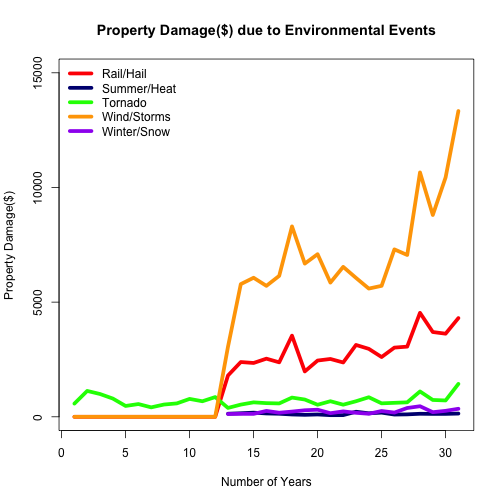

Health and Environmental Consequences of Environmental Events
========================================================
author: Jonathan O'Hara
date: 20th October 2014

Synopsis
========================================================

This shiny application aims to address two questions:
<ol>
<li>Across the United States, which types of events are most harmful with respect to population health?</li>
<li>Across the United States,which types of events have the greatest economic consequences?</li>
</ol>

- Use the ComboBox to select between charts of consequences for: Human Fatalities, Human Injuries, and Property Damage.
- Overall, wind and thunderstorms appear to be the most harmful environmental events for both population health and economic consequences.

Human Fatalities
========================================================

- Wind and storms were the leading cause of fatalities caused by environmental events.
- Summer and heat were the second greatest cause of fatalities.
 

Human Injuries
========================================================

- Wind and thunderstorms were responsible for more injuries than any other environmental effect year after year since data on wind and thunderstorms has been collected.
 

Property Damage
========================================================

- Of all environmental effects, wind and thunder storms were found to be the primary source of property damage.
 
